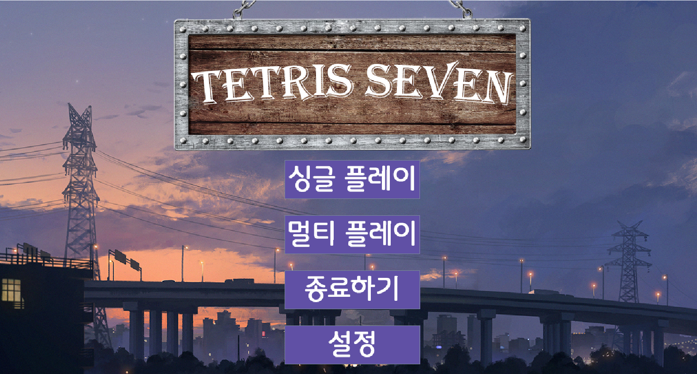

## 테트리스 게임
- 개선 프로젝트

웹소켓을 활용하여 원격 게임 플레이를 구현한 프로젝트

### 개선아이디어

1. 블록이 바닥에 떨어질 위치를 미리 표시해 주는 기능
2. 게임 시간 표시
3. 다음 블록 표시
4. 블록 hold
5. 사운드
6. 게임 진행 튜토리얼모드
7. 블록 한 줄을 파괴할 때마다 제한 시간이 늘어나는 시간제한 모드
8. 스프린트모드
9. Super Rotation System
10. 로그인 기능과 멀티플레이 랭킹시스템 도임(서버)
11. 2인이 한 컴퓨터를 이용하는 경쟁 모드(로컬)
12. 2인이 각자의 컴퓨터를 이용해서 멀티플레이 경쟁(서버)
13. 줄을 지울때마다 Single, Double, Triple, Tetris 글자 표시
14. 키보드 설정 기능 추가
15. 로컬랭킹 추가

추가적인 게임 플레이 모드의 구현.

SRS시스템의 도입

간단한 튜토리얼

깃허브 페이지 링크
https://github.com/Kim5eongkwang/JBNU_SE_Tetris.git
https://github.com/RGBRaccoon/WebSocketClientTetris.git
https://github.com/RGBRaccoon/webSocketServer_success.git